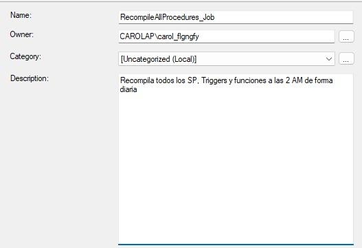
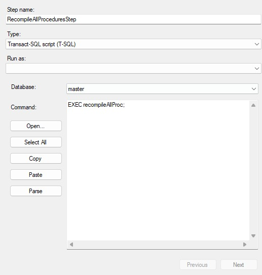
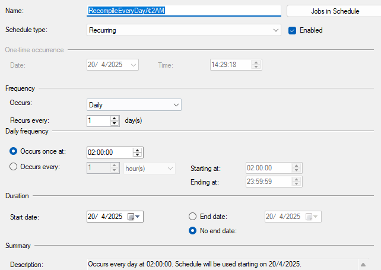

# 🎓 Caso #2 - 35%

### 🛠️ Temas Abordados:
- T-SQL
- Seguridad
- Concurrencia
- Performance
- Transacciones
- Migrado de datos

---

## 👨‍🏫 Curso: Bases de Datos I  
**Ciclo:** I Ciclo, 2025  
**Profesor:** Rodrigo Núñez  

---

## 👥 Estudiantes

| Nombre                     | Carné       |
|---------------------------|-------------|
|  Priscilla Romero Barquero | `2023332718` |
|  Carol Araya Conejo       | `2024089174` |
|  Daniel Sequeira Requenes | `2023282470` |
|  Carlos Abarca Mora       | `2024138701` |

---
## 🧱 Diseño de la Base de Datos - 20 pts
- **MongoDB:**  
  > 

- **SQL Server:**  
  > 

## 🧪 Test de la Base de Datos - 65 pts

Ahora que ya Soltura cuenta con un diseño de base de datos aprobados por los ingenieros, CTO, contrapartes ingenieros de Soltura, se les ha pedido que realicen pruebas contextuales para medir el comportamiento, técnicas, rendimiento y semántica de la base de datos diseñada en SQL Server. A continuación se detallan todos los test requeridos.

### 📊 Población de Datos

Crear scripts de llenado utilizando exclusivamente T-SQL, cumpliendo los siguientes requisitos:

- El sistema debe operar con al menos dos monedas (ej. CRC y USD).
- Crear al menos 25 usuarios con suscripciones activas y 5 usuarios sin suscripción, distribuidos entre diferentes regiones o afiliaciones.
- Cargar los catálogos base del sistema:
  - Tipos de servicios (gimnasios, salud, parqueos, etc.)
  - Tipos de planes
  - Métodos de pago
  - Monedas
  - Estados de suscripción
- Llenar la tabla de planes de suscripción, con variaciones como:
  - Joven Deportista
  - Familia de Verano
  - Viajero Frecuente
  - Nómada Digital
- Incluir al menos 7 empresas proveedoras de servicios, cada una ofreciendo entre 2 y 4 combinaciones de servicios. Estas combinaciones deben utilizarse para definir entre 7 y 9 planes distintos.
- Para cada plan de servicios, deben existir entre 3 y 6 suscripciones, cada una asignada a usuarios únicos que no estén repetidos en otras combinaciones.

---
### Catalogo Base del sistema
El siguiente script corresponde a la carga de catálogos base del sistema, desarrollado en T-SQL:
#### Tipos de Recordatorios (`caipi_remindertypes`)
```sql
INSERT INTO [dbo].[caipi_remindertypes] ([name], [description])
VALUES
    ('SMS', 'Envío de notificaciones por mensaje de texto'),
    ('Email', 'Envío de notificaciones por correo electrónico'),
    ('Push', 'Notificación dentro de la aplicación móvil'),
    ('WhatsApp', 'Notificación enviada por WhatsApp'),
    ('Popup', 'Ventana emergente dentro del sistema');
```

#### Subscription Status

```sql
INSERT INTO [dbo].[caipi_subscription_status] ([name], [description], [enable])
VALUES
    ('Activa', 'La suscripción está activa y operativa', 1),
    ('Pendiente', 'La suscripción está en proceso de activación o aprobación', 1),
    ('Suspendida', 'La suscripción ha sido pausada temporalmente', 1),
    ('Cancelada', 'La suscripción fue cancelada por el usuario o el sistema', 1),
    ('Expirada', 'La suscripción ha llegado a su fecha de expiración', 1);
```

---

#### Subscription Types

```sql
INSERT INTO [dbo].[caipi_subscription_types] ([name], [description], [customizable])
VALUES
    ('Mensual', 'Plan mensual con beneficios fijos', 0),
    ('Mensual Personalizable', 'Plan mensual con beneficios modificables por el usuario', 1),
    ('Anual', 'Plan anual con beneficios fijos', 0),
    ('Anual Personalizable', 'Plan anual con beneficios modificables por el usuario', 1),
    ('Trimestral', 'Plan trimestral con beneficios fijos', 0),
    ('Trimestral Personalizable', 'Plan trimestral con beneficios modificables por el usuario', 1),
    ('Semestral', 'Plan semestral con beneficios fijos', 0),
    ('Semestral Personalizable', 'Plan semestral con beneficios modificables por el usuario', 1);
```

---

#### Subscription Settings Types

```sql
INSERT INTO [dbo].[caipi_suscriptionSettingTypes] ([sucriptionSettingTypeId], [name], [description], [enable])
VALUES
    (1, 'Cantidad de beneficiarios', 'Número máximo de personas que pueden usar la suscripción', 1),
    (2, 'Acceso a servicios adicionales', 'Permite acceso a beneficios o servicios complementarios', 1),
    (3, 'Frecuencia de uso', 'Cantidad de veces que se puede utilizar el servicio en un periodo', 1),
    (4, 'Periodo de validez', 'Duración total del plan o suscripción', 1),
    (5, 'Cobertura geográfica', 'Zonas o ubicaciones donde es válido el plan', 1),
    (6, 'Soporte incluido', 'Tipo de asistencia disponible dentro del plan', 1),
    (7, 'Capacidad de uso', 'Límite en volumen, cantidad o tiempo de uso permitido', 1),
    (8, 'Acceso a contenido exclusivo', 'Permite acceso a beneficios especiales no estándar', 1),
    (9, 'Renovación automática', 'Indica si la suscripción se renueva sin intervención del usuario', 1),
    (10, 'Nivel de personalización', 'Grado en el que el usuario puede modificar los beneficios del plan', 1);
```

---

#### Payment Methods

```sql
INSERT INTO [dbo].[caipi_paymentMethods] ([name], [apiURL], [secretKey], [key], [enable])
VALUES
    ('PayPal', 'https://api.paypal.com/v1/', 0x5A3D4C6F2A7B9C5F1234567890ABCDE1234567890ABCDEF0123456789ABCDEF, 0x7F5A9B6C5D7E1F23334567890ABCDE1234567890ABCDEF0123456789ABCDE, 1),
    ('Stripe', 'https://api.stripe.com/v1/', 0x8F3A7B9C1D2E3F9A1234567890ABCDE1234567890ABCDEF0123456789ABCDE, 0x9B3D6C2F1D8E7A234567890ABCDE1234567890ABCDEF0123456789ABCDE, 1),
    ('MercadoPago', 'https://api.mercadopago.com/v1/', 0x2D3A5F9B1C7E9D3A567890ABCDE1234567890ABCDEF0123456789ABCDE, 0x4F2A8D6E3B9F0A234567890ABCDE1234567890ABCDEF0123456789ABCDE, 1),
    ('RappiPay', 'https://api.rappipay.com/v1/', 0x1A3D4E5F2B8C9D3A567890ABCDE1234567890ABCDEF0123456789ABCDE, 0x5E7A9D2B6C3F4A1234567890ABCDE1234567890ABCDEF0123456789ABCDE, 1),
    ('Apple Pay', 'https://api.apple.com/v1/', 0x0B5D6F3A2C8E9D234567890ABCDE1234567890ABCDEF0123456789ABCDE, 0x9C7F2A3D8B5E1F9A234567890ABCDE1234567890ABCDEF0123456789ABCDE, 1);
```

#### InsertarPaymentMethods Procedure
```sql
CREATE PROCEDURE InsertarPaymentMethods
	--no hay parametros
AS
BEGIN
    -- Declaración de variables
    DECLARE @i INT = 1;
    DECLARE @name NVARCHAR(50);
    DECLARE @methodId INT;
    DECLARE @token NVARCHAR(100);
    DECLARE @expTokenDate DATETIME;
    DECLARE @maskAccount VARCHAR(10);
    DECLARE @callbackURL NVARCHAR(100);
    DECLARE @configurationDetails NVARCHAR(MAX);
    DECLARE @refreshToken VARBINARY(MAX);

    -- Cursor para recorrer los métodos de pago existentes, recibiendo loda daros de la consulta select de la tabla que contiene los metodos de pago
    DECLARE method_cursor CURSOR FOR
        SELECT [name],[methodId]
        FROM [dbo].[caipi_paymentMethods];

    OPEN method_cursor;
    FETCH NEXT FROM method_cursor INTO @name, @methodId; --Recorre el primerregistro, almacena el nombre y el id del metodo que sera utilizado en la insercion

    -- Ciclo para insertar datos en la tabla de métodos de pago
    WHILE @i <= 15
    BEGIN
		-- Asignar valores dinámicos a las variables
        SET @token = CONVERT(NVARCHAR(100), NEWID());
        SET @expTokenDate = DATEADD(DAY, @i * 30, GETDATE());  -- Asignación de fechas, incrementa cada 30 días
        SET @maskAccount = CONCAT('****', RIGHT('000' + CAST((1000 + @i * 7) AS VARCHAR), 4));  -- Cuenta enmascarada con incremento
        SET @callbackURL = CONCAT('https://example.com/callback/method', @i);
        SET @configurationDetails = CONCAT('{"currency":"USD", "method":"', @name, '"}');
        SET @refreshToken = CAST(HASHBYTES('SHA2_256', @token) AS VARBINARY(MAX));  -- Encriptación del token

        -- Insertar el registro en la tabla
        INSERT INTO [dbo].[caipi_availablePaymentMethods]
           ([name], [token], [expTokenDate], [maskAccount], [callbackURL], [configurationDetails], [refreshToken], [methodId])
        VALUES
           (@name, @token, @expTokenDate, @maskAccount, @callbackURL, @configurationDetails, @refreshToken, @methodId);  -- Usa @methodId como ID del método QUE ES APUNTADO POR EL CURSOR

        SET @i += 1;  -- Incrementar el contador para el siguiente ciclo
        -- Obtener el siguiente método de pago
        FETCH NEXT FROM method_cursor INTO @name, @methodId;

		-- Si ya se recorrio hasta último registro, vuelve al inicio para volver a recorrer la consulta
		IF @@FETCH_STATUS <> 0 -- Ya no hay más registros
		BEGIN
			-- Reinicia el cursor a la primera fila
			CLOSE cursor_example;
			DEALLOCATE cursor_example;

			-- Reabriendo el cursor
			OPEN cursor_example;
			FETCH NEXT FROM cursor_example INTO @name, @methodId; -- Vuelve al primer registro
		END
    END

    -- Cerrar y liberar el cursor
    CLOSE method_cursor;
    DEALLOCATE method_cursor;
END
```

#### AddPaymentMethodsPerSupplier Procedure
```sql
CREATE PROCEDURE AddPaymentMethodsPerSupplier
	--SIN PARAMETROS
AS
BEGIN
	--Declare local variables
	DECLARE @SupplierQuantity INT = 15 --cantidad de proveedores
	DECLARE @MethodsQuantity INT = 5 --cantidad de metodos disponibles
	DECLARE @MethodId INT --Id del metodo seleccionado de forma aleatoria
	DECLARE @SupplierCount INT = 1 --Contador de ciclo que recorre los registros de proveedores el cual funciona tambien como ID del supplier


	WHILE @SupplierCount <= @SupplierQuantity
    BEGIN
		--Escoge un metodo de pago disponible entre los id registrados con el checkscum obtengo distintos valores en cada interacion de RAND
		SET @MethodId = FLOOR(1 + RAND(CHECKSUM(NEWID())) * @MethodsQuantity);

		INSERT INTO [dbo].[caipi_AvailablePaymentMethodsPerSuppliers]
			   ([enable]
			   ,[paymentMethodId]
			   ,[supplierId])
		 VALUES
			   (1
			   ,@MethodId
			   ,@SupplierCount)

		SET @SupplierCount +=1;
	END
END
```

#### Insert Transaction Types
```sql
INSERT INTO [dbo].[caipi_transTypes] ([transactionTypeId], [name], [deleted], [transTypeId])
VALUES
    (1, 'Credit', 0, 101),            
    (2, 'Debit', 0, 102),              
    (3, 'Refund', 0, 103),           
    (4, 'Manual Adjustment', 0, 104),  
    (5, 'Chargeback', 0, 105),            
    (6, 'Deposit', 0, 106),               
    (7, 'Withdrawal', 0, 107),            
    (8, 'Transfer', 0, 108);         
```

#### Insert Transaction Sub Types
```sql
INSERT INTO [dbo].[caipi_transSubTypes] ([name], [deleted])
VALUES
    ('Prize Awarded', 0),
    ('Product Purchase', 0),
    ('Refund Claim', 0),
    ('Transaction Approval', 0),
    ('Subscription Payment', 0),
    ('Service Activation', 0),
    ('Account Credit', 0),
    ('Service Cancellation', 0),
    ('Balance Adjustment', 0),
    ('Interest Payment', 0);
```

#### Insert Log Severity Levels
```sql
INSERT INTO [dbo].[caipi_logSeverity] ([name])
VALUES
    ('Low'),
    ('Medium'),
    ('High'),
    ('Critical'),
    ('Informational');
```

#### Insert Log Sources
```sql
INSERT INTO [dbo].[caipi_logsSources] ([name])
VALUES
    ('System'),
    ('Application'),
    ('Database'),
    ('Security'),
    ('User Activity'),
	('Network'),
    ('API'),
    ('Payment Gateway'),
    ('Error Handler'),
    ('Authentication'),
    ('File System');
```

#### Insert Log Types
```sql
INSERT INTO [dbo].[caipi_logTypes] ([name])
VALUES
    ('Error'),
    ('Warning'),
    ('Info'),
    ('Debug'),
    ('Critical'),
    ('Audit'),
    ('Security'),
    ('Transaction'),
    ('Performance'),
    ('Access');
```

#### Insert Unit Measures
```sql
INSERT INTO [dbo].[caipi_measureUnits] ([name], [enable], [deleted], [dataType])
VALUES
    ('Hora', 1, 0, 'Decimal'),
    ('Pieza', 1, 0, 'Integer'),
    ('Colones', 1, 0, 'Decimal'),
    ('Kilogramo', 1, 0, 'Decimal'),
    ('Litro', 1, 0, 'Decimal'),
    ('Clase', 1, 0, 'Integer'),
    ('Consulta', 1, 0, 'Integer'),
    ('Servicio', 1, 0, 'Integer'),
	('Descuento', 1, 0, 'Integer'),
	('Almuerzo', 1, 0, 'Integer'),
	('Dias', 1, 0, 'Integer');
```
#### Services Types
```sql
INSERT INTO [dbo].[caipi_serviceTypes] ([idServiceType], [name], [description], [enable])
VALUES
    (1, 'Gimnasios', 'Servicios de entrenamiento físico y bienestar', 1),
    (2, 'Salud', 'Centros médicos, clínicas y servicios de salud', 1),
    (3, 'Parqueos', 'Zonas de estacionamiento para vehículos', 1),
    (4, 'Comedores', 'Servicios de alimentación y comedores comunitarios', 1),
    (5, 'Educación', 'Escuelas, guarderías y centros de aprendizaje', 1),
    (6, 'Transporte', 'Servicios de transporte público o privado', 1),
    (7, 'Cultura', 'Centros culturales, bibliotecas y museos', 1),
    (8, 'Recreación', 'Áreas recreativas y de esparcimiento', 1),
    (9, 'Deporte', 'Instalaciones deportivas y clubes atléticos', 1),
    (10, 'Tecnología', 'Acceso a servicios tecnológicos y digitales', 1);
```

#### Services
```sql
INSERT INTO [dbo].[caipi_services] ([name], [description], [enable], [image], [idServiceType])
VALUES
    ('Membresía de Gimnasio', 'Acceso a instalaciones de gimnasio', 1, 1, 1),
    ('Clases de Yoga', 'Sesiones de yoga para principiantes y avanzados, con enfoque en bienestar y flexibilidad', 1, 2, 1),
    ('Corte y Cuidado de Mascotas', 'Servicio profesional de grooming', 1, 3, 2),
    ('Consultas Veterinarias', 'Consultas médicas para mascotas', 1, 4, 2),
    ('Clases de Natación', 'Clases de natación para personas de todas las edades, desde principiantes hasta avanzados', 1, 5, 9),
    ('Descuento en Combustible', 'Descuento mensual en combustible, aplicable en estaciones de servicio seleccionadas', 1, 6, 6),
    ('Pedidos de Comida a Domicilio', 'Descuento y promociones en pedidos de comida a través de plataformas de entrega', 1, 7, 4),
    ('Descuentos en Viajes', 'Descuentos en viajes realizados', 1, 8, 6),
    ('Mantenimiento para Mascotas', 'Paquete completo de salud preventiva y cuidado para mascotas', 1, 9, 2),
    ('Entrenamiento Deportivo', 'Clases de fútbol', 1, 10, 9),
    ('Servicios de Belleza', 'Corte de cabello, tratamientos faciales y corporales, manicura y pedicura', 1, 11, 2),
    ('Asesoría Nutricional', 'Consultas con nutricionistas para mejorar la dieta y el estilo de vida saludable', 1, 12, 2),
    ('Estacionamiento Privado', 'Acceso a espacios de estacionamiento privado en zonas estratégicas', 1, 13, 3),
    ('Entrenamiento Personalizado', 'Entrenamiento físico y nutricional a medida, con seguimiento personalizado', 1, 14, 1);
```

#### Modules
```sql
INSERT INTO [dbo].[caipi_modules]
           ([name], [enable], [deleted])
     VALUES
           ('Gestión de Planes', 1, 0),
           ('Módulo de Membresías', 1, 0),
           ('Módulo de Pagos y Facturación', 1, 0),
           ('Módulo de Notificaciones', 1, 0),
           ('Módulo de Servicios', 1, 0),
           ('Módulo de Proveedores', 1, 0),
           ('Módulo de Suscripciones', 1, 0),
           ('Módulo de Reportes', 1, 0),
           ('Módulo de Usuarios', 1, 0),
           ('Módulo de Seguridad', 1, 0);
```

#### Redemption Transaction Types
```sql
INSERT INTO [dbo].[caipi_RedemptionTransactionTypes]
           ([name], [enable], [deleted])
     VALUES
           ('Cupon', 1, 0),
           ('NFC', 1, 0),
           ('QR', 1, 0);
```

#### Redemption Sub Types
```sql
INSERT INTO [dbo].[caipi_redemptionSubType]
           ([name], [enable], [deleted])
     VALUES
           ('Proveedor',1,0),
           ('Usuario',1,0),
           ('Servicio',1,0);
```

#### Notification Methods
```sql
INSERT INTO [dbo].[caipi_notificationmethods]
           ([name], [lastupdate], [createddate], [enabled], [callbackurlget], [callbackurlpost], [callbackurlredirect], [messagingserviceid], [authtoken])
     VALUES
           ('SendGrid Email', GETDATE(), GETDATE(), 1, 'https://api.sendgrid.com/get', 'https://api.sendgrid.com/post', 'https://api.sendgrid.com/redirect', 'SENDGRID_SERVICE_ID', 'SENDGRID_API_KEY'),
           ('Mailgun Email', GETDATE(), GETDATE(), 1, 'https://api.mailgun.com/get', 'https://api.mailgun.com/post', 'https://api.mailgun.com/redirect', 'MAILGUN_SERVICE_ID', 'MAILGUN_API_KEY'),
           ('Twilio SMS', GETDATE(), GETDATE(), 1, 'https://api.twilio.com/get', 'https://api.twilio.com/post', 'https://api.twilio.com/redirect', 'SMXXXXXX', 'twilio_auth_token');
```

#### Contact Info Type
```sql
INSERT INTO [dbo].[caipi_contactInfoType]
           ([name], [enable])
     VALUES
           ('Email',1),
           ('Numero Telefonico',1),
           ('Fax',1),
           ('Sitio Web',1),
           ('Numero Movil',1);
```

#### Contact Info Per Supplier
```sql
INSERT INTO [dbo].[caipi_contactInfoPerSupplier]
           ([enable], [value], [contactInfoTypeId], [idSupplier])
     VALUES
           (1, 'info@theretreatcr.com', 1, 1),
           (1, '+506 4000 1234', 2, 1),
           (1, 'contacto@vidamia.com', 1, 2),
           (1, '+506 4000 5678', 5, 2),
           (1, 'www.agromedica.cr', 4, 3),
           (1, '+506 2222 3333', 2, 3),
           (1, 'pawsco@vetservices.com', 1, 4),
           (1, '+506 8888 7777', 5, 4),
           (1, 'www.thepetsclub.cr', 4, 5),
           (1, '+506 6000 9000', 2, 5),
           (1, 'info@volairstudio.com', 1, 6),
           (1, '+506 7000 8000', 5, 6),
           (1, 'smartfit@fitness.com', 1, 7),
           (1, 'www.smartfit.cr', 4, 7),
           (1, 'amamaser@wellness.com', 1, 8);
```

#### Countries
```sql
INSERT INTO [dbo].[caipi_countries]
           ([countryId], [name], [phoneCode])
     VALUES
           (1, 'Costa Rica', '+506'),
           (3, 'México', '+52'),
           (5, 'Colombia', '+57'),
           (6, 'Argentina', '+54'),
           (7, 'Chile', '+56'),
           (8, 'Perú', '+51'),
           (9, 'Brasil', '+55');
```

#### States
```sql
INSERT INTO [dbo].[caipi_states]
           ([name], [enable], [countryId])
     VALUES
           ('Cartago', 1, 1),
           ('San José', 1, 1),
           ('Puntarenas', 1, 1), 
           ('Guerrero', 1, 3), 
           ('Jalisco', 1, 3),
           ('California', 1, 5), 
           ('Antioquia', 1, 5), 
           ('Valle del Cauca', 1, 5), 
           ('Buenos Aires', 1, 6), 
           ('Mendoza', 1, 6), 
           ('Santa Fe', 1, 6),
           ('Santiago', 1, 7),
           ('Lima', 1, 8);
```

#### Cities
```sql
INSERT INTO [dbo].[caipi_cities]
           ([name], [enable], [stateId])
     VALUES
           ('Guadalupe', 1, 1), 
           ('Cartago', 1, 1), 
           ('Turrialba', 1, 1), 
           ('Guadalajara', 1, 5), 
           ('Tlaquepaque', 1, 5), 
           ('Zapopan', 1, 7), 
           ('Medellín', 1, 7), 
           ('Envigado', 1, 7), 
           ('Itagüí', 1, 5), 
           ('Buenos Aires', 1, 9),
           ('La Plata', 1, 9), 
           ('Mar del Plata', 1, 9), 
           ('Santiago', 1, 12),
           ('Providencia', 1, 12), 
           ('Las Condes', 1, 12), 
           ('Lima', 1, 13),
           ('Miraflores', 1, 13), 
           ('San Isidro', 1, 13);
```

#### Types Branch
```sql
INSERT INTO [dbo].[caipi_typesBranch]
           ([name], [enable], [deleted])
     VALUES
           ('Fisica', 1, 0),
           ('Ecommerce', 1, 0),
           ('Distribución', 1, 0),
           ('Móvil', 1, 0),
           ('Atención al Cliente', 1, 0),
           ('Corporativa', 1, 0),
           ('Atención Especializada', 1, 0),
           ('Soporte Técnico', 1, 0);
```


### 🔎 Demostraciones T-SQL (uso de instrucciones específicas)
Todos las pruebas a continuación se deben hacer en uno o varios scripts TSQL. Perfectamente un solo query puede resolver varios puntos de las pruebas.

1. Cursor local, mostrando que no es visible fuera de la sesión de la base de datos.

2. Cursor global, accesible desde otras sesiones de la base de datos.

3. Uso de un trigger (por ejemplo, para log de inserciones en pagos).

4. Uso de `sp_recompile`, cómo podría estar recompilando todos los SP existentes cada cierto tiempo.

5. Uso de `MERGE` para sincronizar datos de planes por ejemplo.

6. `COALESCE` para manejar valores nulos en configuraciones de usuario.

7. `SUBSTRING` para extraer partes de descripciones.

8. `LTRIM` para limpiar strings.

9. `AVG` con agrupamiento (ej. promedio de montos pagados por usuario).

10. `TOP` para mostrar top 5 planes más populares.

11. `&&` en que caso se usa.

12. `SCHEMABINDING` demostrar que efectivamente funciona en SPs, vistas, funciones.

13. `WITH ENCRYPTION` demostrar que es posible encriptar un SP y que no lo violenten.

14. `EXECUTE` AS para ejecutar SP con impersonificación, es posible? qué significa eso?

15. `UNION` entre planes individuales y empresariales por ejemplo.

16. `DISTINCT` para evitar duplicados en servicios asignados por ejemplo.
---
##### Uso de un TRIGGER
El TRIGGER es un SP que se ejecuta automaticamente en respuesta de un evento en una tabla o vista desde la base de datos. En este caso, se utiliza con fines de auditoria, en caso de generarse una actualizacion de datos en un usuario, el trigger despues de la actualizacion *UPDATE* genera una incersion en la tabla `caipi_logs` en el cual el registro almacena el movimiento. Con el TRIGGER, se puede acceder los datos anteriores y los datos insertados, en el caso de T-SQL un *UPDATE* es manipulado por un DELETED (Viejos datos) y un INSERTED (Nuevos datos)
```sql
DROP TRIGGER IF EXISTS log_insertUserUpdate;
GO

CREATE TRIGGER log_insertUserUpdate
ON caipi_users --nombre de la tabla
AFTER UPDATE --accion sobre la tabla
AS
BEGIN
    SET NOCOUNT ON;--para que no devuelva cuantas filas fueron afectadas
	--Inserta el registro en el log
    INSERT INTO caipi_logs (
        [description], [computer], [username], [trace],
        [referenceId1], [referenceId2], [value1], [value2],
        [chechsum], [logSeverityId], [logSourceId], [logTypeId]
    )
    SELECT
        'Usuario Actualizado - UserName: ' + CAST(i.username AS VARCHAR(100)),
        HOST_NAME(),
        SYSTEM_USER,
        'TRACE-' + CAST(ABS(CHECKSUM(NEWID())) % 10000 AS VARCHAR(10)),
        'Rol',
        'Nombre Usuario',
        i.role,
        i.name+i.lastname,
        CHECKSUM(i.userId,d.userid, i.name,d.name, i.lastname,d.lastname, i.password,d.password, i.role,d.role),
        3, -- Medium severity
        5, -- Payment system source
        1  -- Information type
    FROM INSERTED i
    INNER JOIN DELETED d ON i.userId = d.userId;
END;
GO

```
##### Uso de `sp_recompile` y cursor local

La instrucción `sp_recompile` permite eliminar (hacer drop) los planes de ejecución que existen actualmente para un procedimiento almacenado (SP), trigger o función, con la finalidad de que se genere un nuevo plan la próxima vez que se ejecute.

Esto es útil porque esos planes de ejecución se crean considerando la cantidad de datos que hay en ese momento. Si la cantidad de datos crece con el tiempo, ese plan ya no es tan eficiente. Al recompilar, se genera un plan optimizado para la cantidad de datos actual y así se mejora el rendimiento.


¿Cómo podría estar recompilando todos los SP existentes cada cierto tiempo?

Por medio de la asigancion de un job a un SQL SERVER Agent, el cual se le asigna la ejecucion del comando *EXEC recompileAllProc;* de forma recurrente y diaria a las 2am.

###### Paso a Paso de la creación del Agente

### 1. Crear un nuevo Job llamado `RecompileAllProcedures_Job`



---

### 2. Asignar el comando que el Job va a ejecutar



---

### 3. Definir un horario (schedule) para el Job

En este caso se define de forma recurrente, con frecuencia **diaria**, y se establece que la hora de ejecución sea a las **2:00 AM**, sin fecha de finalización.




El uso de un *cursor local* en la siguiente procedure es que a la hora almacenar el conjunto de filas que devuelve la instruccion SELECT o tambien conocidas como conjunto de resultados. El cursos puede colocarse en una fila especifica o recuperar fila por fila del conjunto de datos, en este caso se usa para recorrer cada fija de la consulta que provee los PROC de la base de datos. 

Al ser local, el nombre del cursor solo es valido en la sesion de ejecucion y se puede hacer referencia al mismo dentro del SP que lo almacena la asignacion del cursor se cancela cuando la ejecucion finaliza. Un ejecmplo de la visibilidad se encuentra en el bloque de codigo el cual dara error si se intenta acceder fuera del SP en el que fue declarado, ya que solamente es visible dentro.

```sql
-- USO DE CURSOR LOCAL Y SP_RECOMPILE
CREATE PROCEDURE recompileAllProc
AS
BEGIN
    -- CURSOR LOCAL QUE RECORRE LOS RESULTADOS DE LA CONSULTA
    DECLARE CURSOR_PROC CURSOR FOR 
    (
        -- OBTIENE LOS NOMBRES DE LOS PROCEDIMIENTOS, FUNCIONES Y TRIGGERS
        SELECT QUOTENAME(S.NAME) + '.' + QUOTENAME(O.NAME) AS PROCNAME 
        FROM 
           SYS.OBJECTS O
           INNER JOIN SYS.SCHEMAS S ON O.SCHEMA_ID = S.SCHEMA_ID
        WHERE O.[TYPE] IN ('P', 'FN', 'IF', 'TR') -- PROCEDIMIENTOS (P), FUNCIONES (FN), IN-LINE FUNCTIONS (IF) Y TRIGGERS (TR) ESTOS SON LOS TIPOS DE PROC QUE SE VAN A RECOMPILAR
    );

    DECLARE @PROCNAME SYSNAME; --EL SYSNAME EQUIVALE A NVARCHAR(128) POR SI HAY CARACTERES UNICODE

	--ABRE EL CURSOR Y LO LLEVA AL PRIMER REGISTRO DE LA CONSULTA
    OPEN CURSOR_PROC;
    FETCH NEXT FROM CURSOR_PROC INTO @PROCNAME; 

    WHILE @@FETCH_STATUS = 0 -- MIENTRAS EL CURSOR NO LLEGUE AL FINAL DE LOS REGISTROS, RECOMPILAR CADA PROCEDIMIENTO
    BEGIN
        EXEC SP_RECOMPILE @PROCNAME; -- EJECUTA LA RECOMPILACIÓN PARA EL PROCEDIMIENTO ALMACENADO
        FETCH NEXT FROM CURSOR_PROC INTO @PROCNAME; -- EL CURSOR PASA AL SIGUIENTE PROCEDIMIENTO
    END;

    -- CIERRA EL CURSOR UTILIZADO
    CLOSE CURSOR_PROC;
    DEALLOCATE CURSOR_PROC;
END;

--mostrando que el cursos local utilizado recompileAllProc y llamado CURSOR_PROC en no es visible fuera de la sesión de la base de datos
--Al intentar hacer referencia al cursor local dara error pues el cursor solo existe dentro de la sesion que se esta ejecutando esto se debe a que es local.
FETCH NEXT FROM CURSOR_PROC INTO @PROCNAME;
```
