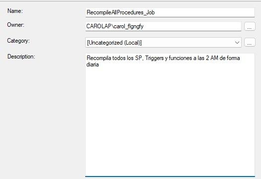
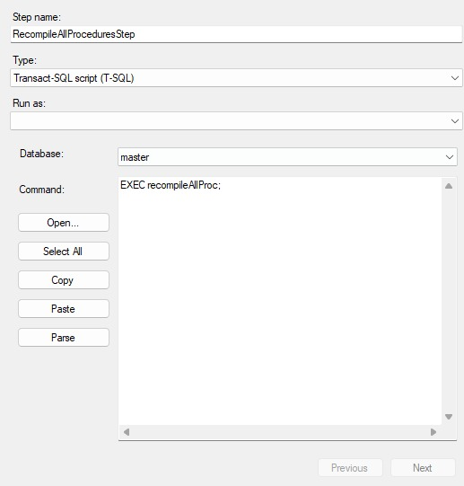
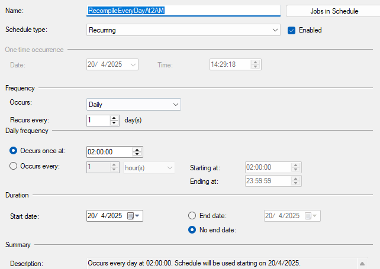

# 🎓 Caso #2 - 35%

### 🛠️ Temas Abordados:
- T-SQL
- Seguridad
- Concurrencia
- Performance
- Transacciones
- Migrado de datos

---

## 👨‍🏫 Curso: Bases de Datos I  
**Ciclo:** I Ciclo, 2025  
**Profesor:** Rodrigo Núñez  

---

## 👥 Estudiantes

| Nombre                     | Carné       |
|---------------------------|-------------|
|  Priscilla Romero Barquero | `2023332718` |
|  Carol Araya Conejo       | `2024089174` |
|  Daniel Sequeira Requenes | `2023282470` |
|  Carlos Abarca Mora       | `2024138701` |

---
## 🧱 Diseño de la Base de Datos - 20 pts
- **MongoDB:**
###### Paquetes informativos
```json
{
    "paquete": [
      {
        "paquete_id": "001",
        "titulo": "Paquete Profesional Joven",
        "descripcion": "Paquete dirigido a profesionales jovenes.",
        "moneda": "CRC",
        "precio": "₡200,000 colones",
        "limitePersonas": 2,
        "imagenURL": "https://img.com/1",
        "creacion": "2025-04-02T12:30:00Z",
        "tiempoValido": "1 mes",
        "beneficios": [
          { 
            "proveedor": "01",
            "beneficio": "Gimnasio", 
            "cantidad": "6 horas por semana" 
          },
          { 
            "proveedor": "02",
            "beneficio": "Lavandería y aplanchado",
            "cantidad": "1 servicio" 
          },
          { 
            "proveedor": "03",
            "beneficio": "Limpieza básica de hogar",
            "cantidad": "2 días" 
          },
          { 
            "proveedor": "Petroleos Delta",
            "beneficio": "Combustible (gas o diésel)", 
            "cantidad": "₡50,000 colones" 
          },
          { 
            "proveedor": "05",
            "beneficio": "Corte de pelo",
            "cantidad": "1 corte" 
          },
          { 
            "proveedor": "06",
            "beneficio": "Cenas seleccionadas",
            "cantidad": "2 cenas" 
          },
          { 
            "proveedor": "07",
            "beneficio": "Almuerzos seleccionados",
            "cantidad": "4 almuerzos" 
          },
          { 
            "proveedor": "08",
            "beneficio": "Plan móvil",
            "cantidad": "Ilimitado" 
          },
          { 
            "proveedor": "09",
            "beneficio": "Parqueo", 
            "cantidad": "10 horas" 
          }
        ],
        "estado": "activo"
      },
      {
        "paquete_id": "002",
        "titulo": "Paquete Full Modern Family",
        "descripcion": "Paquete ideal para familias modernas.",
        "moneda": "CRC",
        "precio": "₡170,000 colones",
        "limitePersonas": 4,
        "imagenURL": "https://img.com/2",
        "creacion": "2025-04-02T12:30:00Z",
        "tiempoValido": "2 meses",
        "beneficios": [
          { 
            "proveedor": "01",
            "beneficio": "Gimnasio (4 personas)", 
            "cantidad": "4 horas por semana" 
          },
          { "proveedor": "10",
            "beneficio": "Yoga o Pilates (familiar)",
            "cantidad": "4 horas" 
          },
          {
            "proveedor": "11",
            "beneficio": "Grooming para mascota", 
            "cantidad": "1 servicio" 
          },
          { 
            "proveedor": "12",
            "beneficio": "Revisión veterinaria",
            "cantidad": "1 consulta" 
          },
          { 
            "proveedor": "13",
            "beneficio": "Clases de natación o fútbol (niños)", 
            "cantidad": "3 clases" 
          },
          { 
            "proveedor": "04",
            "beneficio": "Combustible (gas o diésel)", 
            "cantidad": "₡100,000 colones" 
          },
          { 
            "proveedor": "14",
            "beneficio": "Comida en casa", 
            "cantidad": "10 pedidos (envío gratis + 20% dto.)" 
          },
          { 
            "proveedor": "15",
            "beneficio": "Uber Rides", 
            "cantidad": "₡7,000 colones en viajes" 
          }
        ],
        "estado": "inactivo"
      },
      {
        "paquete_id": "003",
        "titulo": "Paquete Relax & Wellness",
        "descripcion": "Paquete perfecto para relajarse y recargar energías en pareja.",
        "moneda": "CRC",
        "precio": "₡155,000 colones",
        "limitePersonas": 5,
        "imagenURL": "https://img.com/3",
        "creacion": "2025-04-10T10:00:00Z",
        "tiempoValido": "1 mes",
        "beneficios": [
          {
            "proveedor": "16",
            "beneficio": "Masaje relajante para 2 personas",
            "cantidad": "1 sesión de 45 minutos"
          },
          {
            "proveedor": "10",
            "beneficio": "Clases de yoga o meditación",
            "cantidad": "4 clases"
          },
          {
            "proveedor": "17",
            "beneficio": "Canasta saludable",
            "cantidad": "1 canasta de snacks y jugos"
          },
          {
            "proveedor": "18",
            "beneficio": "Desayuno gourmet",
            "cantidad": "2 desayunos"
          },
          {
            "proveedor": "19",
            "beneficio": "Entradas al cine",
            "cantidad": "2 entradas + palomitas"
          },
          {
            "proveedor": "15",
            "beneficio": "Transporte incluido",
            "cantidad": "₡5,000 colones en viajes"
          },
          {
            "proveedor": "08",
            "beneficio": "Plan de datos temporal",
            "cantidad": "Internet ilimitado por 1 semana"
          }
        ],
        "estado": "activo"
      }
      
    ]
  }
```

```json
{
    "proveedores": [
      {
        "id": "01",
        "nombre": "SmartFit",
        "url": "https://www.smartfit.com",
        "logo": "https://logo.clearbit.com/smartfit.com"
      },
      {
        "id": "02",
        "nombre": "Lavadería Pressto",
        "url": "https://www.pressto.com",
        "logo": "https://logo.clearbit.com/pressto.com"
      },
      {
        "id": "03",
        "nombre": "Broomday",
        "url": "https://broomday.cr",
        "logo": "https://imgur.com/broomday_logo.png"
      },
      {
        "id": "04",
        "nombre": "Petroleos Delta",
        "url": "https://www.deltacr.com",
        "logo": "https://logo.clearbit.com/deltacr.com"
      },
      {
        "id": "05",
        "nombre": "Vainilla beauty",
        "url": "https://www.instagram.com/vainillabeautycr/",
        "logo": "https://imgur.com/vainilla_logo.png"
      },
      {
        "id": "06",
        "nombre": "El novillo alegre",
        "url": "https://www.elnovilloalegre.com",
        "logo": "https://logo.clearbit.com/elnovilloalegre.com"
      },
      {
        "id": "07",
        "nombre": "Rostipollos",
        "url": "https://www.rostipollos.com",
        "logo": "https://logo.clearbit.com/rostipollos.com"
      },
      {
        "id": "08",
        "nombre": "Kolbi",
        "url": "https://www.kolbi.cr",
        "logo": "https://logo.clearbit.com/kolbi.cr"
      },
      {
        "id": "09",
        "nombre": "Valet Parking",
        "url": "https://valetparking.cr",
        "logo": "https://imgur.com/valetparking_logo.png"
      },
      {
        "id": "10",
        "nombre": "Gym Tec",
        "url": "https://gymtec.cr",
        "logo": "https://imgur.com/gymtec_logo.png"
      },
      {
        "id": "11",
        "nombre": "Hipermascotas",
        "url": "https://hipermascotas.cr",
        "logo": "https://imgur.com/hipermascotas_logo.png"
      },
      {
        "id": "12",
        "nombre": "La Vete",
        "url": "https://lavete.cr",
        "logo": "https://imgur.com/lavete_logo.png"
      },
      {
        "id": "13",
        "nombre": "Crol Swimming",
        "url": "https://www.crolswimming.com",
        "logo": "https://logo.clearbit.com/crolswimming.com"
      },
      {
        "id": "14",
        "nombre": "Uber Eats",
        "url": "https://www.ubereats.com",
        "logo": "https://logo.clearbit.com/ubereats.com"
      },
      {
        "id": "15",
        "nombre": "Uber",
        "url": "https://www.uber.com",
        "logo": "https://logo.clearbit.com/uber.com"
      },
      {
        "id": "16",
        "nombre": "Spa Vida Zen",
        "url": "https://www.spavidazen.com",
        "logo": "https://logo.clearbit.com/spavidazen.com"
      },
      {
        "id": "17",
        "nombre": "Fresh Market",
        "url": "https://www.freshmarket.cr",
        "logo": "https://logo.clearbit.com/freshmarket.cr"
      },
      {
        "id": "18",
        "nombre": "Café Arte",
        "url": "https://cafearte.cr",
        "logo": "https://imgur.com/cafearte_logo.png"
      },
      {
        "id": "19",
        "nombre": "Cinemark",
        "url": "https://www.cinemarkca.com",
        "logo": "https://logo.clearbit.com/cinemarkca.com"
      }
    ]
  }
```

##### Promociones
```json
{
    "promociones": [
      {
        "promo_id": "001",
        "titulo": "Descuento en gimnasio con SmartFit",
        "descripcion": "Obtén un 25% de descuento en membresías mensuales con SmartFit al adquirir el Paquete Profesional Joven.",
        "creado_el": "2025-04-10T09:00:00Z",
        "valido_hasta": "2025-05-10T23:59:59Z",
        "imagenURL": "https://imgpromo.com/smartfit25.png",
        "promoURL": "https://soltura.cr/promociones/001",
        "codigoBarras": "1234567890123",
        "condiciones": [
          "Válido solo para nuevas membresías.",
          "No acumulable con otras promociones.",
          "Aplicable únicamente en gimnasios SmartFit participantes."
        ],
        "tipoPromocion": "descuento",
        "estado": "inactivo"
      },
      {
        "promo_id": "002",
        "titulo": "10% de descuento en tu primer plan Soltura personalizado",
        "descripcion": "Arma tu propio paquete con los servicios que más usás: gimnasio, comida, belleza, transporte y más. ¡Y obtené un 10% de descuento en tu primer mes!",
        "creado_el": "2025-04-14T08:00:00Z",
        "valido_hasta": "2025-05-31T23:59:59Z",
        "imagenURL": "https://soltura.cr/media/promo-soltu-personal.png",
        "promoURL": "https://soltura.cr/promociones/002",
        "codigoBarras": "7894561230123",
        "condiciones": [
            "Válido solo para nuevos usuarios de planes personalizados.",
            "El descuento se aplica únicamente al primer mes del plan.",
            "No acumulable con otras promociones activas.",
            "Promoción válida únicamente en planes creados desde la app oficial de Soltura."
        ],
        "tipoPromocion": "descuento",
        "estado": "activo"
      },
      {
        "promo_id": "003",
        "titulo": "¡Invitá a un amigo y ambos obtienen 1 mes gratis!",
        "descripcion": "Recomendá Soltura a tus amigos y por cada uno que se registre y active su primer plan, ambos recibirán un mes completamente gratis en su membresía.",
        "creado_el": "2025-04-14T08:00:00Z",
        "valido_hasta": "2025-06-30T23:59:59Z",
        "imagenURL": "https://soltura.cr/media/promo-amigos.png",
        "promoURL": "https://soltura.cr/promociones/003",
        "codigoBarras": "998877665544",
        "condiciones": [
          "La persona referido debe activar un plan Soltura en los primeros 7 días tras registrarse.",
          "La promoción aplica únicamente si ambos usuarios completan el proceso de verificación.",
          "Solo se otorga 1 mes gratuito por cada referido.",
          "Promoción válida hasta agotar existencias de meses gratuitos o hasta la fecha de finalización."
        ],
        "tipoPromocion": "referido",
        "estado": "activo"
      }    
    ]
  }
```

##### Mercadeo y Media
```json
{
    "marketing_media": [
      {
        "media_id": "001",
        "tipo": "video",
        "titulo": "Soltura: Lo que tu rutina necesitaba",
        "descripcion": "Historias reales de usuarios que transformaron su día a día con Soltura.",
        "videourl": "https://soltura.cr/media/vida-simplificada.mp4",
        "url_thumbnail": "https://soltura.cr/media/thumb-vida.jpg",
        "duracion": "03:02",
        "formato": "mp4",
        "etiquetas": ["vida real", "usuarios", "transformación", "ahorro"],
        "fecha_publicacion": "2025-04-10T10:00:00Z",
        "estadisticas": {
            "vistas": 3200,
            "comentarios": 15
        },
        "estado": "activo"
      },
      {
        "media_id": "002",
        "tipo": "imagen",
        "titulo": "Una vida más ligera empieza con Soltura",
        "descripcion": "Historias visuales: día relajado, cero trámites, todo resuelto. Soltura es la libertad en acción.",
        "imagenURL": "https://soltura.cr/media/vida-ligera.jpg",
        "formato": "jpg",
        "resolucion": "2480x3508 px",
        "dimensiones": {
          "ancho": 1080,
          "alto": 1080
        },
        "etiquetas": ["vida ligera", "beneficios"],
        "fecha_publicacion": "2025-04-13T12:00:00Z",
        "estadisticas": {
            "vistas": 5200,
            "comentarios": 12
        },
        "estado": "activo"
      },
      {
        "media_id": "003",
        "tipo": "video",
        "titulo": "Soltura ahora en todo el país",
        "descripcion": "Ahora puedes simplificar tu vida desde cualquier lugar. Ampliamos cobertura a 5 ciudades nuevas.",
        "videourl": "https://soltura.cr/media/ampliacion.mp4",
        "url_thumbnail": "https://soltura.cr/media/thumb-ampliacion.jpg",
        "duracion": "01:10",
        "formato": "mp4",
        "etiquetas": ["Costa Rica", "beneficios", "ahorro"],
        "fecha_publicacion": "2025-05-13T12:00:00Z",
        "estadisticas": {
            "vistas": 200,
            "comentarios": 2
        },
        "estado": "activo"
      }

    ]
  }
```

##### Servicio al cliente - Seguimento de casos - Reviews - Resolución de quejas
```json
{
  "casos": [
    {
      "id_caso": "CASO-2024-001",
      "fecha_apertura": "2024-05-15T09:30:00-06:00",
      "agente_asignado": "Carol Araya",  
      "cliente": {
        "nombre": "Carlos Abarca",
        "identificacion": "1-1923-0668",
        "contacto": {
          "medio": "WhatsApp Business",
          "detalle": "+506 8888-1234"
        }
      },
      "asunto": {
        "tipo": "Reclamo",
        "subtipo": "Facturación incorrecta",
        "descripcion": "Cobro duplicado en factura #45678 del servicio Premium."
      },
      "atencion": [
        {
          "fecha": "2024-05-15T09:35:00-06:00",
          "accion": "Verificación de factura en sistema",
          "comentario": "Se confirma cobro duplicado por error de sistema."
        },
        {
          "fecha": "2024-05-15T10:00:00-06:00",
          "accion": "Solución propuesta",
          "comentario": "Se programa reembolso automático en 3 días hábiles.",
          "respuesta_cliente": "Cliente conforme con la solución."
        }
      ],
      "estado": "resuelto",
      "fecha_cierre": "2024-05-15T10:15:00-06:00"
    },
    {
      "id_caso": "CASO-2024-002",
      "fecha_apertura": "2024-05-16T14:20:00-06:00",
      "agente_asignado": "Priscilla Barquero",  
      "cliente": {
        "nombre": "Daniel Sequeira",
        "identificacion": "2-3456-7890",
        "contacto": {
          "medio": "Llamada telefónica",
          "detalle": "+506 7000-5678"
        }
      },
      "asunto": {
        "tipo": "Consulta",
        "subtipo": "Cobertura de servicios",
        "descripcion": "¿Incluye el Plan Básico consultas médicas urgentes?"
      },
      "atencion": [
        {
          "fecha": "2024-05-16T14:25:00-06:00",
          "accion": "Revisión de cobertura",
          "comentario": "Se explica que solo cubre consultas no urgentes."
        },
        {
          "fecha": "2024-05-16T14:28:00-06:00",
          "accion": "Solución propuesta",
          "comentario": "Se explican los planes que sí incluyen consultas médicas urgentes.",
          "respuesta_cliente": "Cliente conforme con la solución."
        }
      ]
    }
  ]
}
```

- **SQL Server:**  
  > 

## 🧪 Test de la Base de Datos - 65 pts

Ahora que ya Soltura cuenta con un diseño de base de datos aprobados por los ingenieros, CTO, contrapartes ingenieros de Soltura, se les ha pedido que realicen pruebas contextuales para medir el comportamiento, técnicas, rendimiento y semántica de la base de datos diseñada en SQL Server. A continuación se detallan todos los test requeridos.

### 📊 Población de Datos

Crear scripts de llenado utilizando exclusivamente T-SQL, cumpliendo los siguientes requisitos:

- El sistema debe operar con al menos dos monedas (ej. CRC y USD).
- Crear al menos 25 usuarios con suscripciones activas y 5 usuarios sin suscripción, distribuidos entre diferentes regiones o afiliaciones.
- Cargar los catálogos base del sistema:
  - Tipos de servicios (gimnasios, salud, parqueos, etc.)
  - Tipos de planes
  - Métodos de pago
  - Monedas
  - Estados de suscripción
- Llenar la tabla de planes de suscripción, con variaciones como:
  - Joven Deportista
  - Familia de Verano
  - Viajero Frecuente
  - Nómada Digital
- Incluir al menos 7 empresas proveedoras de servicios, cada una ofreciendo entre 2 y 4 combinaciones de servicios. Estas combinaciones deben utilizarse para definir entre 7 y 9 planes distintos.
- Para cada plan de servicios, deben existir entre 3 y 6 suscripciones, cada una asignada a usuarios únicos que no estén repetidos en otras combinaciones.

---
### Catalogo Base del sistema
El siguiente script corresponde a la carga de catálogos base del sistema, desarrollado en T-SQL:
#### Tipos de Recordatorios (`caipi_remindertypes`)
```sql
INSERT INTO [dbo].[caipi_remindertypes] ([name], [description])
VALUES
    ('SMS', 'Envío de notificaciones por mensaje de texto'),
    ('Email', 'Envío de notificaciones por correo electrónico'),
    ('Push', 'Notificación dentro de la aplicación móvil'),
    ('WhatsApp', 'Notificación enviada por WhatsApp'),
    ('Popup', 'Ventana emergente dentro del sistema');
```

#### Subscription Status

```sql
INSERT INTO [dbo].[caipi_subscription_status] ([name], [description], [enable])
VALUES
    ('Activa', 'La suscripción está activa y operativa', 1),
    ('Pendiente', 'La suscripción está en proceso de activación o aprobación', 1),
    ('Suspendida', 'La suscripción ha sido pausada temporalmente', 1),
    ('Cancelada', 'La suscripción fue cancelada por el usuario o el sistema', 1),
    ('Expirada', 'La suscripción ha llegado a su fecha de expiración', 1);
```

---

#### Subscription Types

```sql
INSERT INTO [dbo].[caipi_subscription_types] ([name], [description], [customizable])
VALUES
    ('Mensual', 'Plan mensual con beneficios fijos', 0),
    ('Mensual Personalizable', 'Plan mensual con beneficios modificables por el usuario', 1),
    ('Anual', 'Plan anual con beneficios fijos', 0),
    ('Anual Personalizable', 'Plan anual con beneficios modificables por el usuario', 1),
    ('Trimestral', 'Plan trimestral con beneficios fijos', 0),
    ('Trimestral Personalizable', 'Plan trimestral con beneficios modificables por el usuario', 1),
    ('Semestral', 'Plan semestral con beneficios fijos', 0),
    ('Semestral Personalizable', 'Plan semestral con beneficios modificables por el usuario', 1);
```

---

#### Subscription Settings Types

```sql
INSERT INTO [dbo].[caipi_suscriptionSettingTypes] ([sucriptionSettingTypeId], [name], [description], [enable])
VALUES
    (1, 'Cantidad de beneficiarios', 'Número máximo de personas que pueden usar la suscripción', 1),
    (2, 'Acceso a servicios adicionales', 'Permite acceso a beneficios o servicios complementarios', 1),
    (3, 'Frecuencia de uso', 'Cantidad de veces que se puede utilizar el servicio en un periodo', 1),
    (4, 'Periodo de validez', 'Duración total del plan o suscripción', 1),
    (5, 'Cobertura geográfica', 'Zonas o ubicaciones donde es válido el plan', 1),
    (6, 'Soporte incluido', 'Tipo de asistencia disponible dentro del plan', 1),
    (7, 'Capacidad de uso', 'Límite en volumen, cantidad o tiempo de uso permitido', 1),
    (8, 'Acceso a contenido exclusivo', 'Permite acceso a beneficios especiales no estándar', 1),
    (9, 'Renovación automática', 'Indica si la suscripción se renueva sin intervención del usuario', 1),
    (10, 'Nivel de personalización', 'Grado en el que el usuario puede modificar los beneficios del plan', 1);
```

---

#### Payment Methods

```sql
INSERT INTO [dbo].[caipi_paymentMethods] ([name], [apiURL], [secretKey], [key], [enable])
VALUES
    ('PayPal', 'https://api.paypal.com/v1/', 0x5A3D4C6F2A7B9C5F1234567890ABCDE1234567890ABCDEF0123456789ABCDEF, 0x7F5A9B6C5D7E1F23334567890ABCDE1234567890ABCDEF0123456789ABCDE, 1),
    ('Stripe', 'https://api.stripe.com/v1/', 0x8F3A7B9C1D2E3F9A1234567890ABCDE1234567890ABCDEF0123456789ABCDE, 0x9B3D6C2F1D8E7A234567890ABCDE1234567890ABCDEF0123456789ABCDE, 1),
    ('MercadoPago', 'https://api.mercadopago.com/v1/', 0x2D3A5F9B1C7E9D3A567890ABCDE1234567890ABCDEF0123456789ABCDE, 0x4F2A8D6E3B9F0A234567890ABCDE1234567890ABCDEF0123456789ABCDE, 1),
    ('RappiPay', 'https://api.rappipay.com/v1/', 0x1A3D4E5F2B8C9D3A567890ABCDE1234567890ABCDEF0123456789ABCDE, 0x5E7A9D2B6C3F4A1234567890ABCDE1234567890ABCDEF0123456789ABCDE, 1),
    ('Apple Pay', 'https://api.apple.com/v1/', 0x0B5D6F3A2C8E9D234567890ABCDE1234567890ABCDEF0123456789ABCDE, 0x9C7F2A3D8B5E1F9A234567890ABCDE1234567890ABCDEF0123456789ABCDE, 1);
```

#### InsertarPaymentMethods Procedure
```sql
CREATE OR ALTER PROCEDURE InsertarPaymentMethods
	--no hay parametros
AS
BEGIN
    -- Declaración de variables
    DECLARE @i INT = 1;
    DECLARE @name NVARCHAR(50);
    DECLARE @methodId INT;
    DECLARE @token NVARCHAR(100);
    DECLARE @expTokenDate DATETIME;
    DECLARE @maskAccount VARCHAR(10);
    DECLARE @callbackURL NVARCHAR(100);
    DECLARE @configurationDetails NVARCHAR(MAX);
    DECLARE @refreshToken VARBINARY(MAX);

    -- Cursor para recorrer los métodos de pago existentes, recibiendo loda daros de la consulta select de la tabla que contiene los metodos de pago
    DECLARE method_cursor CURSOR FOR
        SELECT [name],[methodId]
        FROM [dbo].[caipi_paymentMethods];

    OPEN method_cursor;
    FETCH NEXT FROM method_cursor INTO @name, @methodId; --Recorre el primerregistro, almacena el nombre y el id del metodo que sera utilizado en la insercion

    -- Ciclo para insertar datos en la tabla de métodos de pago
    WHILE @i <= 15
    BEGIN
		-- Asignar valores dinámicos a las variables
        SET @token = CONVERT(NVARCHAR(100), NEWID());
        SET @expTokenDate = DATEADD(DAY, @i * 30, GETDATE());  -- Asignación de fechas, incrementa cada 30 días
        SET @maskAccount = CONCAT('****', RIGHT('000' + CAST((1000 + @i * 7) AS VARCHAR), 4));  -- Cuenta enmascarada con incremento
        SET @callbackURL = CONCAT('https://example.com/callback/method', @i);
        SET @configurationDetails = CONCAT('{"currency":"USD", "method":"', @name, '"}');
        SET @refreshToken = CAST(HASHBYTES('SHA2_256', @token) AS VARBINARY(MAX));  -- Encriptación del token

        -- Insertar el registro en la tabla
        INSERT INTO [dbo].[caipi_availablePaymentMethods]
           ([name], [token], [expTokenDate], [maskAccount], [callbackURL], [configurationDetails], [refreshToken], [methodId])
        VALUES
           (@name, @token, @expTokenDate, @maskAccount, @callbackURL, @configurationDetails, @refreshToken, @methodId);  -- Usa @methodId como ID del método QUE ES APUNTADO POR EL CURSOR

        SET @i += 1;  -- Incrementar el contador para el siguiente ciclo
        -- Obtener el siguiente método de pago
        FETCH NEXT FROM method_cursor INTO @name, @methodId;

		-- Si ya se recorrio hasta último registro, vuelve al inicio para volver a recorrer la consulta
		IF @@FETCH_STATUS <> 0 -- Ya no hay más registros
		BEGIN
			-- Reinicia el cursor a la primera fila
			CLOSE method_cursor;

			-- Reabriendo el cursor
			OPEN method_cursor;
			FETCH NEXT FROM method_cursor INTO @name, @methodId; -- Vuelve al primer registro
		END
    END

    -- Cerrar y liberar el cursor
    CLOSE method_cursor;
    DEALLOCATE method_cursor;
END
```

#### AddPaymentMethodsPerSupplier Procedure
```sql
/*

	Crea la relacion de los metodos de pago existentes y disponibles para cada proveedor, asigna solo 1 y diferente para el mismo.

*/
CREATE OR ALTER PROCEDURE AddPaymentMethodsPerSupplier
	--SIN PARAMETROS
AS
BEGIN
	--Declare local variables
	DECLARE @SupplierQuantity INT = 15 --cantidad de proveedores
	DECLARE @MethodsQuantity INT = 5 --cantidad de metodos disponibles
	DECLARE @MethodId INT --Id del metodo seleccionado de forma aleatoria
	DECLARE @SupplierCount INT = 1 --Contador de ciclo que recorre los registros de proveedores el cual funciona tambien como ID del supplier


	WHILE @SupplierCount <= @SupplierQuantity
    BEGIN
		--Escoge un metodo de pago disponible entre los id registrados con el checkscum obtengo distintos valores en cada interacion de RAND
		SET @MethodId = FLOOR(1 + RAND(CHECKSUM(NEWID())) * @MethodsQuantity);

		INSERT INTO [dbo].[caipi_AvailablePaymentMethodsPerSuppliers]
			   ([enable]
			   ,[paymentMethodId]
			   ,[supplierId])
		 VALUES
			   (1
			   ,@MethodId
			   ,@SupplierCount)

		SET @SupplierCount +=1;
	END
END
```

#### Insert Transaction Types
```sql
INSERT INTO [dbo].[caipi_transTypes] ([transactionTypeId], [name], [deleted], [transTypeId])
VALUES
    (1, 'Credit', 0, 101),            
    (2, 'Debit', 0, 102),              
    (3, 'Refund', 0, 103),           
    (4, 'Manual Adjustment', 0, 104),  
    (5, 'Chargeback', 0, 105),            
    (6, 'Deposit', 0, 106),               
    (7, 'Withdrawal', 0, 107),            
    (8, 'Transfer', 0, 108);         
```

#### Insert Transaction Sub Types
```sql
INSERT INTO [dbo].[caipi_transSubTypes] ([name], [deleted])
VALUES
    ('Prize Awarded', 0),
    ('Product Purchase', 0),
    ('Refund Claim', 0),
    ('Transaction Approval', 0),
    ('Subscription Payment', 0),
    ('Service Activation', 0),
    ('Account Credit', 0),
    ('Service Cancellation', 0),
    ('Balance Adjustment', 0),
    ('Interest Payment', 0);
```

#### Insert Log Severity Levels
```sql
INSERT INTO [dbo].[caipi_logSeverity] ([name])
VALUES
    ('Low'),
    ('Medium'),
    ('High'),
    ('Critical'),
    ('Informational');
```

#### Insert Log Sources
```sql
INSERT INTO [dbo].[caipi_logsSources] ([name])
VALUES
    ('System'),
    ('Application'),
    ('Database'),
    ('Security'),
    ('User Activity'),
	('Network'),
    ('API'),
    ('Payment Gateway'),
    ('Error Handler'),
    ('Authentication'),
    ('File System');
```

#### Insert Log Types
```sql
INSERT INTO [dbo].[caipi_logTypes] ([name])
VALUES
    ('Error'),
    ('Warning'),
    ('Info'),
    ('Debug'),
    ('Critical'),
    ('Audit'),
    ('Security'),
    ('Transaction'),
    ('Performance'),
    ('Access');
```

#### Insert Unit Measures
```sql
INSERT INTO [dbo].[caipi_measureUnits] ([name], [enable], [deleted], [dataType])
VALUES
    ('Hora', 1, 0, 'Decimal'),
    ('Pieza', 1, 0, 'Integer'),
    ('Colones', 1, 0, 'Decimal'),
    ('Kilogramo', 1, 0, 'Decimal'),
    ('Litro', 1, 0, 'Decimal'),
    ('Clase', 1, 0, 'Integer'),
    ('Consulta', 1, 0, 'Integer'),
    ('Servicio', 1, 0, 'Integer'),
	('Descuento', 1, 0, 'Integer'),
	('Almuerzo', 1, 0, 'Integer'),
	('Dias', 1, 0, 'Integer');
```
#### Services Types
```sql
INSERT INTO [dbo].[caipi_serviceTypes] ([idServiceType], [name], [description], [enable])
VALUES
    (1, 'Gimnasios', 'Servicios de entrenamiento físico y bienestar', 1),
    (2, 'Salud', 'Centros médicos, clínicas y servicios de salud', 1),
    (3, 'Parqueos', 'Zonas de estacionamiento para vehículos', 1),
    (4, 'Comedores', 'Servicios de alimentación y comedores comunitarios', 1),
    (5, 'Educación', 'Escuelas, guarderías y centros de aprendizaje', 1),
    (6, 'Transporte', 'Servicios de transporte público o privado', 1),
    (7, 'Cultura', 'Centros culturales, bibliotecas y museos', 1),
    (8, 'Recreación', 'Áreas recreativas y de esparcimiento', 1),
    (9, 'Deporte', 'Instalaciones deportivas y clubes atléticos', 1),
    (10, 'Tecnología', 'Acceso a servicios tecnológicos y digitales', 1);
```

#### Services
```sql
INSERT INTO [dbo].[caipi_services] ([name], [description], [enable], [image], [idServiceType])
VALUES
    ('Membresía de Gimnasio', 'Acceso a instalaciones de gimnasio', 1, 1, 1),
    ('Clases de Yoga', 'Sesiones de yoga para principiantes y avanzados, con enfoque en bienestar y flexibilidad', 1, 2, 1),
    ('Corte y Cuidado de Mascotas', 'Servicio profesional de grooming', 1, 3, 2),
    ('Consultas Veterinarias', 'Consultas médicas para mascotas', 1, 4, 2),
    ('Clases de Natación', 'Clases de natación para personas de todas las edades, desde principiantes hasta avanzados', 1, 5, 9),
    ('Descuento en Combustible', 'Descuento mensual en combustible, aplicable en estaciones de servicio seleccionadas', 1, 6, 6),
    ('Pedidos de Comida a Domicilio', 'Descuento y promociones en pedidos de comida a través de plataformas de entrega', 1, 7, 4),
    ('Descuentos en Viajes', 'Descuentos en viajes realizados', 1, 8, 6),
    ('Mantenimiento para Mascotas', 'Paquete completo de salud preventiva y cuidado para mascotas', 1, 9, 2),
    ('Entrenamiento Deportivo', 'Clases de fútbol', 1, 10, 9),
    ('Servicios de Belleza', 'Corte de cabello, tratamientos faciales y corporales, manicura y pedicura', 1, 11, 2),
    ('Asesoría Nutricional', 'Consultas con nutricionistas para mejorar la dieta y el estilo de vida saludable', 1, 12, 2),
    ('Estacionamiento Privado', 'Acceso a espacios de estacionamiento privado en zonas estratégicas', 1, 13, 3),
    ('Entrenamiento Personalizado', 'Entrenamiento físico y nutricional a medida, con seguimiento personalizado', 1, 14, 1);
```

#### Modules
```sql
INSERT INTO [dbo].[caipi_modules]
           ([name], [enable], [deleted])
     VALUES
           ('Gestión de Planes', 1, 0),
           ('Módulo de Membresías', 1, 0),
           ('Módulo de Pagos y Facturación', 1, 0),
           ('Módulo de Notificaciones', 1, 0),
           ('Módulo de Servicios', 1, 0),
           ('Módulo de Proveedores', 1, 0),
           ('Módulo de Suscripciones', 1, 0),
           ('Módulo de Reportes', 1, 0),
           ('Módulo de Usuarios', 1, 0),
           ('Módulo de Seguridad', 1, 0);
```

#### Redemption Transaction Types
```sql
INSERT INTO [dbo].[caipi_RedemptionTransactionTypes]
           ([name], [enable], [deleted])
     VALUES
           ('Cupon', 1, 0),
           ('NFC', 1, 0),
           ('QR', 1, 0);
```

#### Redemption Sub Types
```sql
INSERT INTO [dbo].[caipi_redemptionSubType]
           ([name], [enable], [deleted])
     VALUES
           ('Proveedor',1,0),
           ('Usuario',1,0),
           ('Servicio',1,0);
```

#### Notification Methods
```sql
INSERT INTO [dbo].[caipi_notificationmethods]
           ([name], [lastupdate], [createddate], [enabled], [callbackurlget], [callbackurlpost], [callbackurlredirect], [messagingserviceid], [authtoken])
     VALUES
           ('SendGrid Email', GETDATE(), GETDATE(), 1, 'https://api.sendgrid.com/get', 'https://api.sendgrid.com/post', 'https://api.sendgrid.com/redirect', 'SENDGRID_SERVICE_ID', 'SENDGRID_API_KEY'),
           ('Mailgun Email', GETDATE(), GETDATE(), 1, 'https://api.mailgun.com/get', 'https://api.mailgun.com/post', 'https://api.mailgun.com/redirect', 'MAILGUN_SERVICE_ID', 'MAILGUN_API_KEY'),
           ('Twilio SMS', GETDATE(), GETDATE(), 1, 'https://api.twilio.com/get', 'https://api.twilio.com/post', 'https://api.twilio.com/redirect', 'SMXXXXXX', 'twilio_auth_token');
```

#### Contact Info Type
```sql
INSERT INTO [dbo].[caipi_contactInfoType]
           ([name], [enable])
     VALUES
           ('Email',1),
           ('Numero Telefonico',1),
           ('Fax',1),
           ('Sitio Web',1),
           ('Numero Movil',1);
```

#### Contact Info Per Supplier
```sql
INSERT INTO [dbo].[caipi_contactInfoPerSupplier]
           ([enable], [value], [contactInfoTypeId], [idSupplier])
     VALUES
           (1, 'info@theretreatcr.com', 1, 1),
           (1, '+506 4000 1234', 2, 1),
           (1, 'contacto@vidamia.com', 1, 2),
           (1, '+506 4000 5678', 5, 2),
           (1, 'www.agromedica.cr', 4, 3),
           (1, '+506 2222 3333', 2, 3),
           (1, 'pawsco@vetservices.com', 1, 4),
           (1, '+506 8888 7777', 5, 4),
           (1, 'www.thepetsclub.cr', 4, 5),
           (1, '+506 6000 9000', 2, 5),
           (1, 'info@volairstudio.com', 1, 6),
           (1, '+506 7000 8000', 5, 6),
           (1, 'smartfit@fitness.com', 1, 7),
           (1, 'www.smartfit.cr', 4, 7),
           (1, 'amamaser@wellness.com', 1, 8);
```

#### Countries
```sql
INSERT INTO [dbo].[caipi_countries]
           ([countryId], [name], [phoneCode])
     VALUES
           (1, 'Costa Rica', '+506'),
           (3, 'México', '+52'),
           (5, 'Colombia', '+57'),
           (6, 'Argentina', '+54'),
           (7, 'Chile', '+56'),
           (8, 'Perú', '+51'),
           (9, 'Brasil', '+55');
```

#### States
```sql
INSERT INTO [dbo].[caipi_states]
           ([name], [enable], [countryId])
     VALUES
           ('Cartago', 1, 1),
           ('San José', 1, 1),
           ('Puntarenas', 1, 1), 
           ('Guerrero', 1, 3), 
           ('Jalisco', 1, 3),
           ('California', 1, 5), 
           ('Antioquia', 1, 5), 
           ('Valle del Cauca', 1, 5), 
           ('Buenos Aires', 1, 6), 
           ('Mendoza', 1, 6), 
           ('Santa Fe', 1, 6),
           ('Santiago', 1, 7),
           ('Lima', 1, 8);
```

#### Cities
```sql
INSERT INTO [dbo].[caipi_cities]
           ([name], [enable], [stateId])
     VALUES
           ('Guadalupe', 1, 1), 
           ('Cartago', 1, 1), 
           ('Turrialba', 1, 1), 
           ('Guadalajara', 1, 5), 
           ('Tlaquepaque', 1, 5), 
           ('Zapopan', 1, 7), 
           ('Medellín', 1, 7), 
           ('Envigado', 1, 7), 
           ('Itagüí', 1, 5), 
           ('Buenos Aires', 1, 9),
           ('La Plata', 1, 9), 
           ('Mar del Plata', 1, 9), 
           ('Santiago', 1, 12),
           ('Providencia', 1, 12), 
           ('Las Condes', 1, 12), 
           ('Lima', 1, 13),
           ('Miraflores', 1, 13), 
           ('San Isidro', 1, 13);
```

#### Types Branch
```sql
INSERT INTO [dbo].[caipi_typesBranch]
           ([name], [enable], [deleted])
     VALUES
           ('Fisica', 1, 0),
           ('Ecommerce', 1, 0),
           ('Distribución', 1, 0),
           ('Móvil', 1, 0),
           ('Atención al Cliente', 1, 0),
           ('Corporativa', 1, 0),
           ('Atención Especializada', 1, 0),
           ('Soporte Técnico', 1, 0);
```

#### Plan Types
```sql
INSERT INTO caipi_planTypes (name, enable, deleted)
VALUES 
('Básico', 1, 0),
('Personalizado', 1, 0),
('Familiar', 1, 0),
('Corporativo', 1, 0),
('Estudiantil', 1, 0),
('Salud y Bienestar', 1, 0);
```

#### Plans
```sql
CREATE PROCEDURE LlenarPlanes
AS
BEGIN
    DECLARE @countPlanes INT = 15;
    DECLARE @planesID INT;
    DECLARE @Name VARCHAR(30);
    DECLARE @planType INT;
    DECLARE @checkSum VARBINARY(255); -- HASHBYTES devuelve VARBINARY
    DECLARE @fecha DATETIME;
    DECLARE @total DECIMAL(5,2);
    DECLARE @mensual DECIMAL(5,2);

    DECLARE @nombres TABLE (nombre VARCHAR(30));
    
    -- Se insertan los 15 planes disponibles 
    INSERT INTO @nombres(nombre)
    VALUES 
        ('Joven Deportista'), ('Familia de Verano'), ('Viajero Frecuente'), ('Nómada Digital'),
        ('Profesional en Movimiento'), ('Estudiante Proactivo'), ('Creativo Freelance'), ('Full Wellness'),
        ('Tiempo en Familia'), ('Explorador Urbano'), ('Hogar Equilibrado'), ('Fit & Chill'),
        ('EcoVida'), ('Combo Soltura'), ('Zen Diario');

    DECLARE @i INT = 1;

 -- Se inicia el ciclo para insertar los 15 planes
    WHILE @i <= 15
    BEGIN
        SET @planesID = @i;

        SELECT @Name = nombre FROM (
            SELECT nombre, ROW_NUMBER() OVER (ORDER BY (SELECT NULL)) AS rn FROM @nombres
        ) AS nombres_ordenados
        WHERE rn = @i;

        -- Tipo de plan entre 1 y 6
        SET @planType = FLOOR(1 + RAND() * 6);

        -- Fecha aleatoria entre 2024-06-01 y hoy
        DECLARE @startDate DATETIME = '2024-06-01 00:00:00';
        DECLARE @secondsRange INT = DATEDIFF(SECOND, @startDate, GETDATE());
        SET @fecha = DATEADD(SECOND, FLOOR(RAND(CHECKSUM(NEWID())) * @secondsRange), @startDate);

        -- Monto total entre 100 y 200
        SET @total = ROUND(100 + (RAND() * 100), 2); 
        -- Monto Mensual entre 50 y 60
        SET @mensual = ROUND(50 + (RAND() * 10), 2);

        -- Checksum
        SET @checkSum = HASHBYTES('SHA2_512', CONCAT(@planesID, @Name, 'fbsdinaldkna3193'));

        -- Insertamos en la tabla
        INSERT INTO caipi_plans(name, description, enable, deleted, checkSum, idplanTypes, effectiveDate, totalAmount, monthlyAmount)
        VALUES (
            @Name, 'Esta es la descripción', 1, 0, @checkSum, @planType, @fecha, @total, @mensual
        );

        SET @i += 1;
    END
END
```

#### Media File Types
```sql
INSERT INTO caipi_mediaFileType (name, enable, deleted)
VALUES
('imagen', 1, 0),
('video', 1, 0);
```

#### Media Files
```sql
INSERT INTO caipi_mediaFiles (idmediaFiles, mediaURL, filename, lastUpdate, idmediaFileType)
VALUES
    (1, 'https://media.soltura.com/plan_fitness_4_personas.mp4', 'Plan de Gimnasio 4 Personas', GETDATE(), 2),
    (2, 'https://media.soltura.com/plan_yoga_familiar.mp4', 'Plan Yoga Familiar', GETDATE(), 2),
    (3, 'https://media.soltura.com/plan_grooming_mascota.jpg', 'Plan Grooming para Mascota', GETDATE(), 1),
    (4, 'https://media.soltura.com/plan_revision_veterinaria.jpg', 'Plan Revisión Veterinaria', GETDATE(), 1),
    (5, 'https://media.soltura.com/plan_clases_natacion_futbol.jpg', 'Plan Clases de Natación y Fútbol Niños', GETDATE(), 1),
    (6, 'https://media.soltura.com/servicio_combustible_gas_diesel.jpg', 'Servicio de Combustible Gas o Diésel', GETDATE(), 1),
    (7, 'https://media.soltura.com/servicio_uber_eats.jpg', 'Servicio Uber Eats', GETDATE(), 1),
    (8, 'https://media.soltura.com/servicio_uber_rides.jpg', 'Servicio Uber Rides', GETDATE(), 1),
    (9, 'https://media.soltura.com/servicio_mantenimiento_mascota.jpg', 'Servicio de Mantenimiento de Mascotas', GETDATE(), 1),
    (10, 'https://media.soltura.com/servicio_plan_clases_futbol.jpg', 'Plan de Clases de Fútbol', GETDATE(), 1),
    (11, 'https://media.soltura.com/servicio_grooming_mascota.jpg', 'Grooming para Mascotas', GETDATE(), 1),
    (12, 'https://media.soltura.com/servicio_revision_salud.jpg', 'Revisión de Salud', GETDATE(), 1),
    (13, 'https://media.soltura.com/servicio_activacion_plan.jpg', 'Activación de Plan', GETDATE(), 1),
    (14, 'https://media.soltura.com/servicio_subscripcion_plan.jpg', 'Suscripción a Planes', GETDATE(), 1),
    (15, 'https://media.soltura.com/servicio_pagos_suscripcion.jpg', 'Pagos de Suscripción', GETDATE(), 1);
```

#### Schedules
```sql
CREATE PROCEDURE llenadoSchedules
AS
BEGIN

    DECLARE @horarios TABLE (
        name VARCHAR(50),
        recurrencyType VARCHAR(20),
        repetition INT
    );
-- Se realiza una inserción en tabla temporal 
    INSERT INTO @horarios (name, recurrencyType, repetition)
    VALUES 
        ('Cada semana', 'semanal', 1),
        ('Cada mes', 'mensual', 1),
        ('Cada 15 días', 'semanal', 2);

    DECLARE @i INT = 1;
    DECLARE @mes INT;
    DECLARE @dia INT;
    DECLARE @endDate DATE;
-- Se insertan en bloques de 13
    WHILE @i <= 13
    BEGIN
        
        SET @mes = FLOOR(RAND(CHECKSUM(NEWID())) * 8) + 5; -- Mes aleatorio

        SET @dia = FLOOR(RAND(CHECKSUM(NEWID())) * 28) + 1; -- Dia aleatorio

        SET @endDate = DATEFROMPARTS(2025, @mes, @dia);

        -- Insertar 3 registros por vuelta
        INSERT INTO caipi_schedules (name, recurrencyType, repetition, endType, endDate)
        SELECT name, recurrencyType, repetition, 'NA', @endDate
        FROM @horarios;

        SET @i += 1;
    END
END;
```

#### Supplier Categories
```sql
INSERT INTO caipi_supplierCategories(name, enable, deleted)
VALUES
('Gimnasios y Fitness', 1, 0),
('Estudios de Yoga', 1, 0),
('Grooming para Mascotas', 1, 0),
('Clínicas Veterinarias', 1, 0),
('Escuelas de Natación', 1, 0),
('Estaciones de Combustible', 1, 0),
('Restaurantes y Comida Rápida', 1, 0),
('Agencias de Viajes', 1, 0),
('Centros de Cuidado Animal', 1, 0),
('Clubes Deportivos', 1, 0),
('Centros de Estética', 1, 0),
('Consultorios Nutricionales', 1, 0),
('Parqueos Privados', 1, 0),
('Entrenadores Personales', 1, 0),
('Proveedores Varios', 1, 0);
```

#### Suppliers 
```sql
INSERT INTO [dbo].[caipi_suppliers] ([name], [enable], [idsupplierCategories], [idmediaFiles], [idagreementTerms], [deleted])
VALUES
('The Retreat Costa Rica', 1, 1, 1, 1, 0), 
('Vida Mia Healing Center', 1, 2, 2, 2, 0),
('Agromédica Veterinaria', 1, 4, 4, 4, 0), 
('Paws & Co.', 1, 3, 3, 3, 0), 
('The Pets Club', 1, 9, 9, 9, 0), 
('VolAir Studio', 1, 2, 2, 2, 0), 
('Smart Fit', 1, 1, 1, 1, 0), 
('AmaSer', 1, 2, 2, 2, 0), 
('Pure Jungle Spa', 1, 11, 11, 11, 0), 
('Aloha Skincare and Wellness', 1, 11, 11, 11, 0), 
('Central de Mascotas', 1, 9, 9, 9, 0), 
('Veterinaria Arroyo y Solano', 1, 4, 4, 4, 0),
('Spoon', 1, 7, 7, 7, 0), 
('Rostipollos', 1, 7, 7, 7, 0), 
('KOKi Beach', 1, 7, 7, 7, 0); 
```


### 🔎 Demostraciones T-SQL (uso de instrucciones específicas)
Todos las pruebas a continuación se deben hacer en uno o varios scripts TSQL. Perfectamente un solo query puede resolver varios puntos de las pruebas.

1. Cursor local, mostrando que no es visible fuera de la sesión de la base de datos.

2. Cursor global, accesible desde otras sesiones de la base de datos.

3. Uso de un trigger (por ejemplo, para log de inserciones en pagos).

4. Uso de `sp_recompile`, cómo podría estar recompilando todos los SP existentes cada cierto tiempo.

5. Uso de `MERGE` para sincronizar datos de planes por ejemplo.

6. `COALESCE` para manejar valores nulos en configuraciones de usuario.

7. `SUBSTRING` para extraer partes de descripciones.

8. `LTRIM` para limpiar strings.

9. `AVG` con agrupamiento (ej. promedio de montos pagados por usuario).

10. `TOP` para mostrar top 5 planes más populares.

11. `&&` en que caso se usa.

12. `SCHEMABINDING` demostrar que efectivamente funciona en SPs, vistas, funciones.

13. `WITH ENCRYPTION` demostrar que es posible encriptar un SP y que no lo violenten.

14. `EXECUTE` AS para ejecutar SP con impersonificación, es posible? qué significa eso?

15. `UNION` entre planes individuales y empresariales por ejemplo.

16. `DISTINCT` para evitar duplicados en servicios asignados por ejemplo.
---
#### Uso de un TRIGGER
El TRIGGER es un SP que se ejecuta automaticamente en respuesta de un evento en una tabla o vista desde la base de datos. En este caso, se utiliza con fines de auditoria, en caso de generarse una actualizacion de datos en un usuario, el trigger despues de la actualizacion *UPDATE* genera una incersion en la tabla `caipi_logs` en el cual el registro almacena el movimiento. Con el TRIGGER, se puede acceder los datos anteriores y los datos insertados, en el caso de T-SQL un *UPDATE* es manipulado por un DELETED (Viejos datos) y un INSERTED (Nuevos datos)
```sql

-- TRIGGER El cual dispara cuando un usuario es actualizado
--Realiza una comparacion de datos nuevos y antiguos con la finalidad de almacenar el el log los cambios hechos en la actualizacion

CREATE OR ALTER TRIGGER log_insertUserUpdate
ON caipi_users
AFTER UPDATE
AS
BEGIN
    SET NOCOUNT ON;
	--declara las variables que se van a utilizar en la consulta
    DECLARE @userId INT,
            @username NVARCHAR(100),
            @old_username NVARCHAR(100),
            @name NVARCHAR(100),
            @old_name NVARCHAR(100),
            @lastname NVARCHAR(100),
            @old_lastname NVARCHAR(100),
            @password NVARCHAR(100),
            @old_password NVARCHAR(100),
            @role NVARCHAR(100),
            @old_role NVARCHAR(100),
            @changedColumns NVARCHAR(MAX);

	--Utilza un cursor local para almacenar los datos de la consulta, del registro insertado y del registro eliminado
    DECLARE cur CURSOR FOR
        SELECT i.userId, i.username, d.username,
               i.name, d.name,
               i.lastname, d.lastname,
               i.password, d.password,
               i.role, d.role
        FROM INSERTED i
        INNER JOIN DELETED d ON i.userId = d.userId;

	--abre el cursor para comenzar a recorrer las filas de la consulta
    OPEN cur;
    FETCH NEXT FROM cur INTO @userId, @username, @old_username,
                            @name, @old_name,
                            @lastname, @old_lastname,
                            @password, @old_password,
                            @role, @old_role;

    WHILE @@FETCH_STATUS = 0
    BEGIN
		--validacion de cambio de datos almacena los cambios realizados en el usuario
        SET @changedColumns = '';
		
        IF @username <> @old_username SET @changedColumns += 'username, ';
        IF @name <> @old_name SET @changedColumns += 'name, ';
        IF @lastname <> @old_lastname SET @changedColumns += 'lastname, ';
        IF @password <> @old_password SET @changedColumns += 'password, ';
        IF @role <> @old_role SET @changedColumns += 'role, ';

        -- Quitar última coma si existe
        IF RIGHT(@changedColumns, 2) = ', ' 
            SET @changedColumns = LEFT(@changedColumns, LEN(@changedColumns) - 2);

	    --Ejecuta el SP que genera el log de actualizar usuario
        EXECUTE sp_LogUpdateUser
            @userId,
            @username,
            @name,
            @lastname,
            @password,
            @role,
            @changedColumns;

		-- recorre el siguiente registro actualizado
        FETCH NEXT FROM cur INTO @userId, @username, @old_username,
                                @name, @old_name,
                                @lastname, @old_lastname,
                                @password, @old_password,
                                @role, @old_role;
    END;

    CLOSE cur;
    DEALLOCATE cur;
END;
GO

```
#### SP que es llamado por el trigger para insertar y log con la finalidad de guardar la integridad del check sum

```sql

CREATE OR ALTER PROCEDURE sp_LogUpdateUser
    @userId INT,
    @username NVARCHAR(100),
    @name NVARCHAR(100),
    @lastname NVARCHAR(100),
    @password NVARCHAR(100),
    @role NVARCHAR(100),
    @changedColumns NVARCHAR(MAX)
AS
BEGIN
    INSERT INTO caipi_logs (
        [description], [computer], [username], [trace],
        [referenceId1], [referenceId2], [value1], [value2],
        [chechsum], [logSeverityId], [logSourceId], [logTypeId]
    )
    VALUES (
        'Usuario Actualizado - UserName: ' + @username,
        HOST_NAME(),
        SYSTEM_USER,
        'TRACE-' + CAST(ABS(CHECKSUM(NEWID())) % 10000 AS VARCHAR(10)),
        'Id Usuario',
        'Cambios Realizados',
        @userId,
        @changedColumns,
        CHECKSUM(@userId, @name, @lastname, @password, @role,@username),
        3,
        5,
        1
    );
END;
GO

```

#### Uso de Cursor global, accesible desde otras sesiones de la base de datos.
Este cursor puede ser referenciado en la conexion. Es decir, puede utilizarse en cualquier SP u otro procediminertos que se esté ejecuctando en la conexion. Por un lado, para ser declarado debe especificarse mediante la palabra reservada `GLOBAL`, en caso de no ser utilizada por defecto será *local*, por otro lado, puede declarse afuera de un procedimiento o bloque.


```sql

--Cursor global
CREATE OR ALTER PROCEDURE Dec_Cursor_Services
AS
BEGIN
    -- Declaro el cursor global para obtener todos los servicios en el sistema de lo cuales solo los activos
    DECLARE Services_Cursor CURSOR GLOBAL
    FOR
    SELECT 
        s.serviceId,
        s.name AS service_name
    FROM 
        dbo.caipi_services s
    WHERE 
        s.enable = 1;  -- Solo servicios habilitados
    
    -- Abrir el cursor
    OPEN Services_Cursor;
END
GO

CREATE OR ALTER PROCEDURE Fetch_Cursor_Services
AS
BEGIN
    -- Variables para almacenar los datos del cursor
    DECLARE @serviceId INT;
    DECLARE @service_name VARCHAR(255);
    DECLARE @total_suppliers INT;

    -- Fetch inicial para obtener el primer servicio
    FETCH NEXT FROM Services_Cursor INTO @serviceId, @service_name;

    -- Mientras haya más filas, seguiran procesandose
    WHILE (@@FETCH_STATUS <> -1)
    BEGIN
        -- Se cuenta cuantos provedores tiene un contrato activos con el servicio
        SELECT 
            @total_suppliers = COUNT(DISTINCT at.idSupplier)
        FROM 
            dbo.caipi_agreementTerms at
        WHERE 
            at.idService = @serviceId
            AND at.enable = 1;  -- Solo relaciones activas

        -- Muestra el resultado directamente
        SELECT 
            @serviceId AS serviceId,
            @service_name AS service_name,
            @total_suppliers AS total_suppliers;

        -- Obtiene la siguiente fila
        FETCH NEXT FROM Services_Cursor INTO @serviceId, @service_name;
    END
END
GO


```

> [!NOTE]
> Esta funcion es ejecutada en otra sesion o fuera del procedimiento con la finalidad de mostrar un cursor global

``` sql

EXEC Dec_Cursor_Services
GO;
EXEC Fetch_Cursor_Services;
CLOSE Services_Cursor
GO;
DEALLOCATE Services_Cursor
GO;

```
##### Uso de `sp_recompile` y cursor local

La instrucción `sp_recompile` permite eliminar (hacer drop) los planes de ejecución que existen actualmente para un procedimiento almacenado (SP), trigger o función, con la finalidad de que se genere un nuevo plan la próxima vez que se ejecute.

Esto es útil porque esos planes de ejecución se crean considerando la cantidad de datos que hay en ese momento. Si la cantidad de datos crece con el tiempo, ese plan ya no es tan eficiente. Al recompilar, se genera un plan optimizado para la cantidad de datos actual y así se mejora el rendimiento.


¿Cómo podría estar recompilando todos los SP existentes cada cierto tiempo?

Por medio de la asigancion de un job a un SQL SERVER Agent, el cual se le asigna la ejecucion del comando *EXEC recompileAllProc;* de forma recurrente y diaria a las 2am.

###### Paso a Paso de la creación del Agente

### 1. Crear un nuevo Job llamado `RecompileAllProcedures_Job`



---

### 2. Asignar el comando que el Job va a ejecutar



---

### 3. Definir un horario (schedule) para el Job

En este caso se define de forma recurrente, con frecuencia **diaria**, y se establece que la hora de ejecución sea a las **2:00 AM**, sin fecha de finalización.




El uso de un *cursor local* en la siguiente procedure es que a la hora almacenar el conjunto de filas que devuelve la instruccion SELECT o tambien conocidas como conjunto de resultados. El cursos puede colocarse en una fila especifica o recuperar fila por fila del conjunto de datos, en este caso se usa para recorrer cada fija de la consulta que provee los PROC de la base de datos. 

Al ser local, el nombre del cursor solo es valido en la sesion de ejecucion y se puede hacer referencia al mismo dentro del SP que lo almacena la asignacion del cursor se cancela cuando la ejecucion finaliza. Un ejecmplo de la visibilidad se encuentra en el bloque de codigo el cual dara error si se intenta acceder fuera del SP en el que fue declarado, ya que solamente es visible dentro.

```sql

CREATE PROCEDURE recompileAllProc
AS
BEGIN
    -- CURSOR LOCAL QUE RECORRE LOS RESULTADOS DE LA CONSULTA
    DECLARE CURSOR_PROC CURSOR FOR 
    (
        -- OBTIENE LOS NOMBRES DE LOS PROCEDIMIENTOS, FUNCIONES Y TRIGGERS
        SELECT QUOTENAME(S.NAME) + '.' + QUOTENAME(O.NAME) AS PROCNAME 
        FROM 
           SYS.OBJECTS O
           INNER JOIN SYS.SCHEMAS S ON O.SCHEMA_ID = S.SCHEMA_ID
        WHERE O.[TYPE] IN ('P', 'FN', 'IF', 'TR') -- PROCEDIMIENTOS (P), FUNCIONES (FN), IN-LINE FUNCTIONS (IF) Y TRIGGERS (TR) ESTOS SON LOS TIPOS DE PROC QUE SE VAN A RECOMPILAR
    );

    DECLARE @PROCNAME SYSNAME; --EL SYSNAME EQUIVALE A NVARCHAR(128) POR SI HAY CARACTERES UNICODE

	--ABRE EL CURSOR Y LO LLEVA AL PRIMER REGISTRO DE LA CONSULTA
    OPEN CURSOR_PROC;
    FETCH NEXT FROM CURSOR_PROC INTO @PROCNAME; 

    WHILE @@FETCH_STATUS = 0 -- MIENTRAS EL CURSOR NO LLEGUE AL FINAL DE LOS REGISTROS, RECOMPILAR CADA PROCEDIMIENTO
    BEGIN
        EXEC SP_RECOMPILE @PROCNAME; -- EJECUTA LA RECOMPILACIÓN PARA EL PROCEDIMIENTO ALMACENADO
        FETCH NEXT FROM CURSOR_PROC INTO @PROCNAME; -- EL CURSOR PASA AL SIGUIENTE PROCEDIMIENTO
    END;

    -- CIERRA EL CURSOR UTILIZADO
    CLOSE CURSOR_PROC;
    DEALLOCATE CURSOR_PROC;
END;

```
> [!NOTE]
> Esta funcion es ejecutada en otra sesion o fuera del procedimiento con la finalidad de mostrar un cursor local
```sql
--mostrando que el cursos local utilizado recompileAllProc y llamado CURSOR_PROC en no es visible fuera de la sesión de la base de datos
--Al intentar hacer referencia al cursor local dara error pues el cursor solo existe dentro de la sesion que se esta ejecutando esto se debe a que es local.
FETCH NEXT FROM CURSOR_PROC INTO @PROCNAME;
```

##### Uso de MERGE

La instruccion `MERGE` funciona para sincronizar datos a una tabla "destino" basado en la información de otra tabla "fuente", se pueden hacer insert, update y delete a partir de ciertas condiciones que se establcen segun los coomponentes de cada una de las tablas.
En este caso se utiliza para automatizar los reminders, ya que se utiliza esta tabla como la tabla destino que será actualizada a partir de la tabla de suscripciones.  Se busca que cada vez que algun registro de la tabla de suscripciones sufra un cambio en su estado y pase a tenerlo como "expirado", se genere automaticamente un mensaje al usuario advirtiendole sobre esto.


```sql
MERGE INTO caipi_reminders AS Destino	-- Tabla a actualizar

-- subconsulta para extraer solo las suscripciones con estado 'expirado' y que no hayan sido eliminadas
USING ( 
    SELECT S.statusid, S.subscriptionid, S.userid	
    FROM caipi_subscriptions S
    WHERE S.statusid = 4 AND S.deleted = 0 ) AS Origen	-- Tabla utilizada para generar los cambios

-- Se establecen las condiciones que se deben verificar antes de generar un nuevo mensaje
ON Destino.userid = Origen.userid  AND 
   Destino.ticketid = CAST(Origen.subscriptionid AS VARCHAR(10)) AND
   Destino.createddate >= DATEADD(DAY, -30, GETDATE())

-- En caso de que las condiciones no se encuentren en 'reminders' se genera un nuevo mensaje
WHEN NOT MATCHED BY TARGET THEN
    INSERT ( message, createddate, lastreminder, ticketid, requestid, expectedresult, successinfo, userid, 
        notificationmethods_notificationmethodid, remindertypeid)
    VALUES ('La suscripcion ha exiprado. Por favor renueve su plan', GETDATE(), 1, 
		CAST(Origen.subscriptionid AS VARCHAR(10)), NULL, NULL, NULL, Origen.userid, 1, 1  );
```


##### Uso de COALESCE

La instruccion `COALESCE` devuelve el primer valor no nulo de una columna solicitada y se utiliza para gestionar la información faltante de los campos en cada columna.
En este caso se utiliza la tabla de _agreement Terms_ ya que muchos de los valores que se manejan esta tabla pueden ser nulos dependiendo del tipo de agreement 
establecido.  En esta consulta lo que se hace es identifiacr los valores nulos de la fecha de firma y en caso de que no haya valor se establece que el contrato
no ha sido firmado.


```sql
SELECT idagreementTerm, startDate, finalDate, agreementPrice,
	COALESCE (signedDate, 'El contrato no ha sido firmado') AS Signed_Date
	FROM caipi_agreementTerms
	ORDER BY idagreementTerm
```


##### Uso de SUBSTRING y LTRIM

La instruccion `SUBSTRING` se utiliza para extraer una cantidad especifica de carcateres de  una cadena con el fin de manipular cadenas de una mejor manera al ser de longitud más pequeña.
Por otro lado, la instrucción `LTRIM` elimina cualquier espacio en blaco que este a la izquierda o inicio de una cadena, esto se utiliza para los datos mal formateados.

En este caso, `SUBSTRING` se utiliza para extraer el numero de telefono de cada usuario dejando de lado el codigo de país al inicio de cada valor. Además se utiliza `LTRIM` para eliminar cualquier espacio en blanco que se presente al incio del nombre y apellido del usuario .

```sql
SELECT 
    LTRIM(u.name) AS Nombre, 
    LTRIM(u.lastname) AS Apellido, -- Nombre y apellido limpios 
    SUBSTRING(ci.value, 5, 8) AS Contacto -- empieza a leer la cadena en la pos 5 y deja 8 caracteres

FROM caipi_contactInfoPerUsers ci
INNER JOIN caipi_users u ON u.userid = ci.userid
WHERE ci.contactInfoTypeId IN (2, 5); -- Numero telefonico y movil
```
##### Uso de AVG

La instruccion `AVG` en SQL sirve para calcular el promedio aritmético de un conjunto de valores numérico.

La siguiente query muestra promedio de montos pagados por usuario.

```sql
SELECT 
	u.userid AS id,
	u.name +' '+ u.lastname AS 'name',
	AVG(p.totalAmount) AS promedio
FROM caipi_users AS u
JOIN caipi_members AS m ON u.userid = m.userid
JOIN caipi_subscriptions AS s on m.subscriptionid = s.subscriptionid
JOIN caipi_plans AS p ON s.idPlan = p.idPlan
GROUP BY u.userid, u.name +' '+ u.lastname
ORDER BY promedio DESC;
```

##### Uso de TOP

La instruccion `TOP` se usa para limitar la cantidad de filas que retorna una consulta. Es como decir “quiero solo los primeros N resultados”.

La siguiente query muestra el `top` 5 de planes mas populares.

```sql
SELECT
	 TOP (5) p.name AS nombre,
	COUNT(p.idPlan) AS ranking
FROM caipi_plans AS p
JOIN caipi_subscriptions AS s ON p.idPlan = s.idPlan
JOIN caipi_members AS m ON s.subscriptionid = m.subscriptionid
GROUP BY p.name
ORDER BY ranking DESC;
```

##### Uso de AND / &&

La instruccion AND es un operador lógico que se usa para combinar dos o más condiciones en una cláusula.

La siguiente query muestra los usuario con suscripcion activas entre los meses 1 `and` 2 `and` si el tipo contiene Trimestral.

```sql
SELECT
	u.name +' '+ u.lastname AS nombre,
	s.startdate,
	t.name AS 'plan'
FROM caipi_users AS u
JOIN caipi_subscriptions AS s ON u.userid = s.userid
JOIN caipi_subscription_types AS t ON s.suscription_typeid = t.suscription_typeid
WHERE 
	MONTH(s.startdate) BETWEEN 1 AND 2
	AND t.name LIKE '%Trimestral%';
```

##### Uso de SCHEMABINDING

La instruccion `SCHEMABINDING` se usa para “atar” un objeto al esquema de las tablas, de modo que no podrás renombrar, 
eliminar ni cambiar tipo de columna en las tablas referenciadas mientras el `SCHEMABINDING` exista.

La siguiente vista muestra agrupaciones de usuarios y cuenta cuántas membresías tienen

```sql
CREATE VIEW dbo.vw_UserMemberships
WITH SCHEMABINDING
AS
    SELECT 
        u.userid,
        u.username,
        COUNT_BIG(*)    AS MemberCount   -- con COUNT_BIG requerido para schemabinding
    FROM dbo.caipi_users    AS u         -- nombres de objeto siempre con esquema
    JOIN dbo.caipi_members  AS m 
      ON u.userid = m.userid
    GROUP BY 
        u.userid,
        u.username;
GO

EXEC sp_rename 
  'dbo.caipi_users.username', 
  'user_name', 
  'COLUMN';
-- Msg 15336, Level 16, State 1, Procedure sp_rename, Line 612 [Batch Start Line 89]
-- Object 'dbo.caipi_users.username' cannot be renamed because the object participates in enforced dependencies.
```
